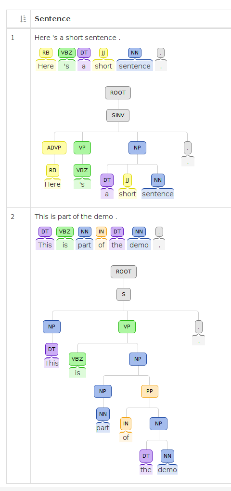

The MeTA NLP demo is currently located at
[http://timan103.cs.illinois.edu/nlp-app/](http://timan103.cs.illinois.edu/nlp-app/).

This demo first segments sentences with the ICU tokenizer. Then, it runs
part-of-speech tagging and a grammatical parser. It displays these outputs for
each sentence.

The demo code can be found [online on
GitHub](https://github.com/meta-toolkit/metapy-demos) in the [MeTA toolkit
organization](https://github.com/meta-toolkit). It makes use of MeTA's
(still experimental) Python bindings to create a simple web application.

Below is the output of running the demo with the input text "Here's a short
sentence. This is part of the demo."

